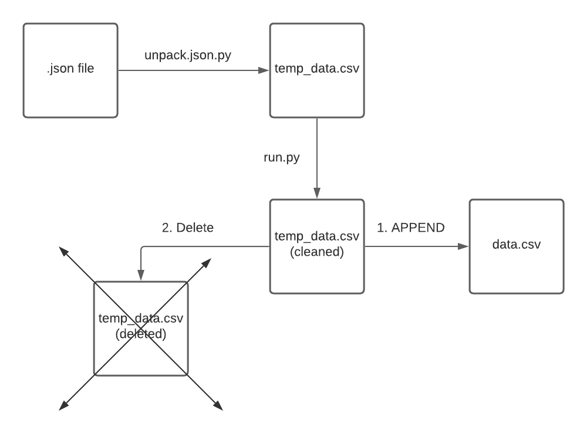
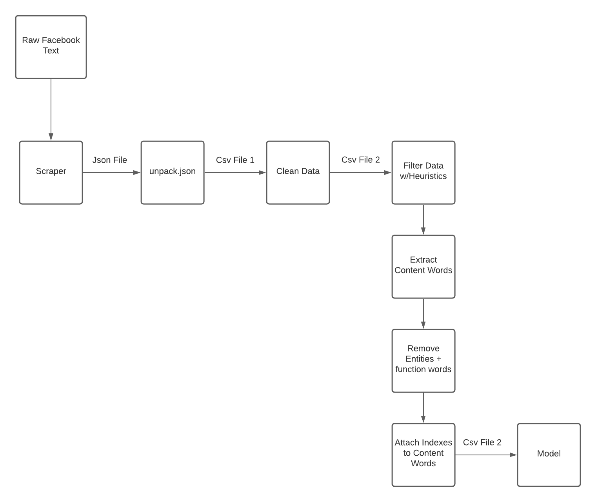

# Facebook Complex Word Identification

Developed as a part of Dr. Yudong Liu research lab (https://cs.wwu.edu/liuy2)  
Currently a work in progress

## Installation

1. Run pip3 install -r requirements.txt to get all packages\

# Facebook Complex Word Identification

Developed as a part of Dr. Yudong Liu research lab (https://cs.wwu.edu/liuy2)  
Currently a work in progress

## Installation

1. Run pip3 install -r requirements.txt to get all packages\
2. When running feature extraction, you'll need to have nlp-core running. Here is an installation guide: https://www.khalidalnajjar.com/setup-use-stanford-corenlp-server-python/

## Instructions For testing data

### 1. Run unpack_json.py to unpack json object into proper data format (text, id)

Note: you can either   1. manually place the json file in the directory and run unpack_json.py   2. or run unpack_json.py with --j command to automatically retrieve the last
downloaded json file from the scraper

### 2. Next, run.py

This will run preprocessing on the text and extract content words using POS tagging and NER.
It will also attach the starting and ending indexes of each content word

### Columns are identified as such:

- sentence - raw social media text. Includes post + comment
- id - postID_commentID_sentenceID
- clean_sentence - preprocessed text
- word - extracted content word
- start_index - beginning index of the content word, from the cleaned text
- end_index - ending index of the content word, from the cleaned text

##### Diagram of Logical Flow

#### Diagram of Pipeline Architecture

## Instructions for Camb_model

### 1. (WIP) (optional for testing data) Run get_testing_data.py to copy data.csv folder to camb directory

For now, you need to manually drag a data\_{number}.csv folder to the camb directory

### 2. Run feature_extracton.py on the test set with the following argument:

example: python3 feature_extraction.py -t data_1

### 3. Run model.py with the following arguements:

#### Training options:

- a = train using all three datasets (news, wikipedia, wikinews)
- tn = train using news dataset, tw = train using wikipedia dataset, ti = train use wikinews dataset

#### Model options:

- ab = adaboost model, rf = random forest model, en = ensemble method (both)

#### Testing options:

- n = test news, w = test wikipedia, i = test wikinews, t = test testing data

Example: python3 model.py -a 1 -t data_1 -ab 1

## Features

- camb_model - Model from https://github.com/siangooding/cwi_2018 (Gooding and Kochmar 2018, 'CAMB at CWI Shared Task 2018: Complex Word Identification with Ensemble-Based Voting', https://www.aclweb.org/anthology/W18-0520.pdf)

- testing_data - Process and format data for input to CAMB model

#### Possible errors

You may have to do: python -m spacy download en_core_web_sm

### Maintainers

Hansel Guzman-Soto (soto26938@gmail.com)\
Carson Vandegriffe (vandegc2@wwu.edu)

### Alumni

Hannah Buzard (buzardh@wwu.edu)
